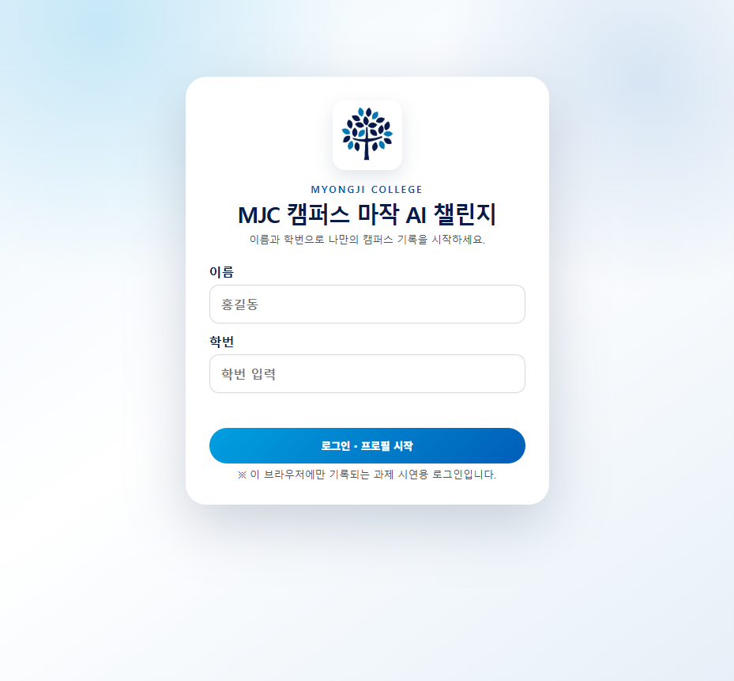
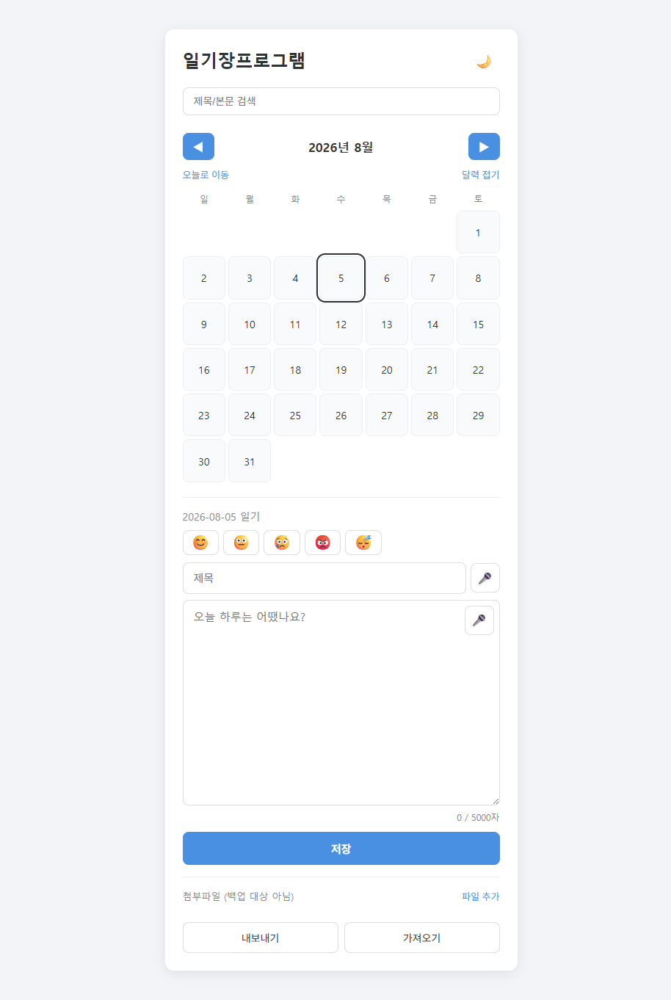
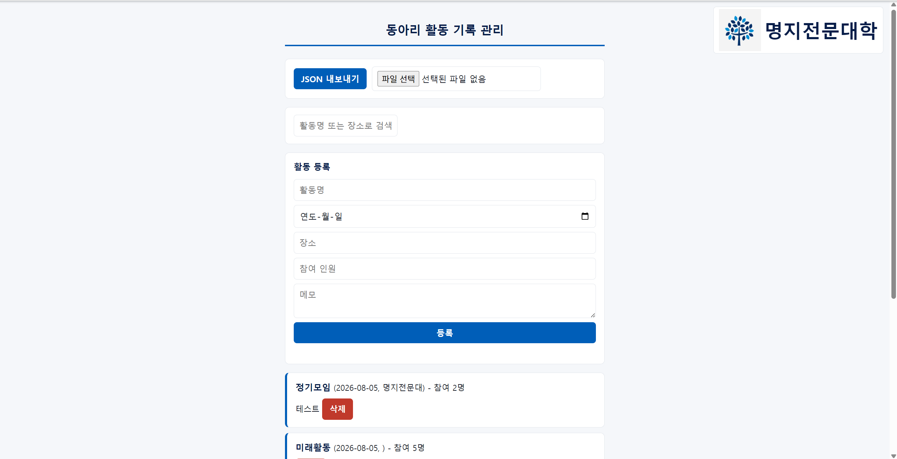
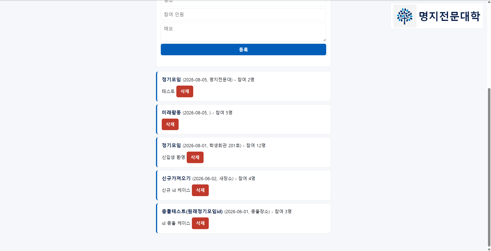

**코드 한입 조 · 임채호(필수기능 담당) · 조영남(선택기능 담당)**
**GitHub 저장소: https://github.com/hoo419/hackathon-codeonebite**

# 해커톤 결과 보고서

---

## 표지

- 팀번호 / 팀이름: 없음 / 코드 한입 조
- 팀원 및 역할: 임채호(필수기능, `app.js`) / 조영남(선택기능, `features.js`)
- GitHub 저장소 URL: https://github.com/hoo419/hackathon-codeonebite
- 제출일: 2026-08-05

---

## 1. 문제 정의와 기획

**이 웹앱이 해결하려는 문제**
동아리 임원들이 활동(정기모임, 행사 등) 내역을 종이나 개인 메모에 흩어서 기록해 관리와 조회가 번거로웠습니다. 그래서 저희는 한 화면에서 활동을 등록·조회·삭제할 수 있는 가벼운 기록 관리 웹앱을 만들었습니다.

**주 사용자와 사용 상황**
동아리 임원(회장·총무 등)이 모임이나 행사가 끝난 직후 활동 내역을 바로 기록하고, 이후 지난 활동을 다시 찾아보거나 정리할 때 사용합니다.

**구현한 필수 기능 3가지**
1. 활동 등록 — 활동명·날짜·장소·참여 인원·메모를 입력해 저장합니다
2. 활동 목록 조회 — 최신순으로 정렬해 표시하고, 빈 목록일 때는 안내 문구를 보여줍니다
3. 활동 삭제 — 삭제 전 확인 절차를 거칩니다

**구현한 선택 기능과 선택한 이유**
- 키워드 검색(활동명·장소, 실시간 필터링): 활동 기록이 쌓일수록 원하는 항목을 빠르게 찾을 수 있어야 한다고 판단했습니다
- 데이터 JSON 내보내기/가져오기: 서버·로그인이 없는 구조라 localStorage가 기기(브라우저)별로 분리됩니다. 그래서 여러 임원이 각자 기록한 내용을 파일로 주고받아 합칠 수 있는 최소한의 협업 수단이 필요하다고 생각했습니다

---

## 2. 설계

**화면 구성**
상단부터 ① JSON 내보내기/가져오기 영역 → ② 검색창 → ③ 활동 등록 폼 → ④ 활동 목록 순으로 배치했습니다.
(`#io-section`, `#search-section`, `#register-section`, `#list-section` 4개 영역으로 나눴습니다)

**데이터 구조**
```json
{ "id": 1, "title": "정기모임", "date": "2026-08-01", "place": "학생회관 201호",
  "memberCount": 12, "memo": "신입생 환영", "createdAt": "2026-08-01T14:00:00" }
```
localStorage 키는 `"activities"`로 정했고, 값은 위 형태 객체의 배열로 저장했습니다.

**파일 구조**
- `index.html` : 화면 구조
- `style.css` : 스타일
- `app.js` : 필수 기능 로직(등록/조회/삭제) — 임채호
- `features.js` : 선택 기능 로직(검색/JSON 내보내기·가져오기) — 조영남
- `CLAUDE.md` : 개발 규칙 및 진행 상황

---

## 3. Claude Code 활용 과정

### 3-1. 작성한 CLAUDE.md

**어떤 규칙을 넣었고, 왜 필요하다고 판단했는지**
서버/DB/빌드 도구 금지, 코딩 스타일(영어 camelCase, 함수 위 한글 주석, 함수 단일 책임, 스페이스 2칸 들여쓰기), 데이터 구조 고정, "하지 말 것" 목록(로그인·회원가입, 이미지/파일 업로드, 한 번에 100줄 넘는 코드 출력 금지 등), 기능 단위 커밋 규칙을 넣었습니다.
저희 팀원 2명이 `app.js`/`features.js`를 각자 동시에 작업하면서도 `getActivities`/`saveActivities`/`renderActivities` 같은 공유 인터페이스가 어긋나지 않게 하고, 서버 없는 환경에서 과제 범위 밖 기능(로그인 등)에 시간을 쓰지 않게 하려는 목적이었습니다.

**작업 도중 규칙을 수정했다면 무엇을 왜 바꿨는지**
처음에는 "임채호=등록+조회 / 조영남=삭제+선택기능"으로 나눴습니다. 하지만 삭제 기능이 목록 렌더링(임채호 담당)과 강하게 결합되어 있어, 조영남님이 임채호의 렌더링 구현이 끝날 때까지 기다려야 하는 문제를 발견했습니다. 그래서 결합도 기준으로 "임채호=필수기능 3개 전부(app.js) / 조영남=선택기능 2개(features.js)"로 다시 나누고, 인터페이스만 먼저 합의하면 실제로 동시에 작업할 수 있도록 CLAUDE.md를 수정했습니다.

### 3-2. 구현 전 계획

처음 세운 계획은 로그인 기능을 만들어 임원 개인정보를 저장하고, 여러 컴퓨터(기기) 간에 데이터가 자동으로 연동되도록 만드는 것이었습니다. 아래는 그 계획과 비슷한 형태로 예전에 만들어 둔 다른 프로그램의 화면입니다(참고용).

**참고 화면 ① — 로그인 화면** (이전에 만든 마작 AI 게임)



**참고 화면 ② — 이미지/파일 업로드 화면** (이전에 만든 일기장 프로그램의 첨부파일 기능)



**실제 작업이 계획과 달라진 부분**
계획을 세우는 과정에서 "서버와 데이터베이스를 사용하지 않는다"는 과제 기술 조건을 간과했습니다. 이후 이 제약을 다시 확인하면서 로그인, 기기 간 자동 연동처럼 서버 없이는 구현할 수 없는 부분을 전부 걷어내고 계획을 최소화했습니다. 그 결과 최종적으로는 로그인 없이 localStorage만 사용하고, 기기 간 데이터 이동은 JSON 내보내기/가져오기로 수동 처리하는 방향으로 축소됐습니다.

### 3-3. 핵심 프롬프트 3건

**① "잠깐 서버랑 데이터베이스 금지가 되어있는데 로그인하고 임원 개인의 정보를 저장하고 관리할 수가 있나?"**
| 구분 | 내용 |
|---|---|
| 어떤 결과를 받았나 | 서버 없이 저장하는 비밀번호는 개발자도구로 그대로 노출되어 실질적 보안 의미가 없고, localStorage는 기기(브라우저)별로 분리되어 로그인 없이도 임원 간 데이터가 자동으로 섞이지 않는다는 설명과 함께 "로그인 기능은 만들지 않는다"는 결론을 제안받았습니다 |
| 만족스러웠는지 | 만족했습니다. 기술 제약(서버 금지)과 과제 범위에 맞는 합리적인 판단이라 그대로 CLAUDE.md에 반영했습니다 |

**② "이렇게 만든다고 할 때 이미지 또는 파일을 업로드할 때 공유가 되는지 저장은 어떻게 되는지?"**
| 구분 | 내용 |
|---|---|
| 어떤 결과를 받았나 | localStorage 용량(보통 5~10MB)에 비해 이미지의 Base64 인코딩 크기가 커서 금방 용량 초과가 나고, 기기 간 공유도 안 된다는 설명을 받았습니다. 대안으로 "파일 링크(URL)만 텍스트로 기록"하는 방식도 제시받았지만, 시간 대비 우선순위가 낮다고 판단했습니다 |
| 만족스러웠는지 | 만족했습니다. 기술적 한계를 명확한 근거로 설명해줘서 선택 기능 범위를 빠르게 좁힐 수 있었습니다 |

**③ "데이터 JSON 내보내기 / 가져오기가 무슨 기능이야?"**
| 구분 | 내용 |
|---|---|
| 어떤 결과를 받았나 | 활동 데이터를 JSON 파일로 다운로드하고, 다른 기기에서 그 파일을 업로드하면 기존 데이터에 추가로 합쳐지는(id 중복 시 새 id 부여) 기능이라는 설명을 받았습니다 |
| 만족스러웠는지 | 만족했습니다. 서버 없는 구조에서 임원 간 데이터를 그나마 옮길 수 있는 현실적인 대안이라 선택 기능으로 채택했습니다 |

### 3-4. 프롬프트 개선 사례 (필수)

- **처음 요청한 내용**: "전부 깃허브 커밋해서 푸시해줘 readme.md파일은 비워두고"
- **결과가 기대와 달랐던 지점**: 저장소 이름에 한글이 포함돼 있어서 자동 생성 과정에서 한글이 전부 빠지고 `hackathon--`라는 이상한 이름으로 저장소가 만들어졌습니다. 그 상태에서 이전에 이미 만들어져 있던 `codeonebite`라는 별도 저장소까지 겹쳐, 저장소가 두 개로 흩어지는 상황이 됐습니다.
- **요청을 어떻게 고쳤는지**: "삭제해"라고 했다가, 이어서 "냅두고 일단 코드원바이트에 올려"로 요청을 구체화해서, 잘못 만든 저장소를 당장 지우려 하기보다 "기존 `codeonebite` 저장소 하나로 통합해 우선 업로드부터 끝내자"는 방향으로 재조정했습니다.
- **고친 뒤 무엇이 달라졌는지**: 삭제 권한(`delete_repo` 스코프) 문제로 잘못 만든 저장소는 즉시 지울 수 없었는데, 요청을 재조정한 덕분에 그 문제에 막히지 않고 기존 `codeonebite` 저장소를 정리(무관한 파일 제거)한 뒤 저희 프로젝트 파일을 병합해 업로드를 먼저 끝낼 수 있었습니다. 이후 과제 제출 양식(`hackathon-<팀이름>`)에 맞춰 저장소 이름도 `hackathon-codeonebite`로 다시 정리했습니다.

### 3-5. 오류 해결 사례 (필수)
- **발생한 오류 (증상)**: 조영남님이 확정된 선택 기능(JSON 내보내기/가져오기) 대신 로그인 기능을 구현하려는 방향으로 작업을 진행하고 있었습니다. 코드 리뷰와 커밋 확인 과정에서 이를 발견했습니다.
- **원인 파악 과정**: 커밋 내역과 작성 중이던 코드를 확인하다가, CLAUDE.md에 이미 정리해둔 "선택 기능 확정(키워드 검색, JSON 내보내기/가져오기 2개)"과 "하지 말 것 — 로그인/회원가입 기능 구현 금지" 규칙과 실제 진행 방향이 어긋나 있음을 확인했습니다.
- **해결 방법**: CLAUDE.md에 명시된 로그인 금지 사유(서버 없이 저장하는 비밀번호는 보안 의미가 없고, 과제의 필수/선택 기능 목록에도 로그인이 없음)를 다시 상기시키고, 원래 확정한 선택 기능(JSON 내보내기/가져오기)으로 방향을 재지시했습니다. 이후 조영남님이 `features.js`에 검색·JSON 내보내기/가져오기 기능을 구현했습니다.
- **이 과정에서 배운 점**: 팀원이 여러 명일 때는 CLAUDE.md에 규칙을 적어두는 것만으로는 충분하지 않고, 작업을 시작하기 전에 "지금부터 뭘 만들지"를 서로 짧게라도 다시 확인하는 절차가 필요하다는 것을 배웠습니다. 또한 "기능 하나가 동작하면 바로 커밋" 규칙 덕분에 방향이 어긋난 작업을 큰 코드가 쌓이기 전에 빨리 발견하고 되돌릴 수 있었습니다.

---

## 4. 실행 결과

**활동 등록 화면** — 검색·JSON 내보내기/가져오기 툴바와 활동 등록 폼



**활동 목록 화면** — 등록된 활동이 최신순 카드 목록으로 표시됨



**테스트한 항목과 결과**
- 활동 등록: 정상 등록 시 목록에 즉시 반영되고 폼이 초기화되는 것을 확인했습니다. 빈 활동명·공백만 있는 활동명이 차단되는 것, 참여 인원 0 이하가 차단되는 것, 미래 날짜가 차단되는 것도 확인했습니다
- 목록 조회: 빈 목록일 때 "등록된 활동이 없습니다." 안내 문구가 뜨는 것을 확인했습니다. 최신순(날짜 내림차순, 동일 날짜는 등록시각순) 정렬도 확인했습니다
- 활동 삭제: 확인 다이얼로그에서 "취소"를 누르면 유지되고, "확인"을 누르면 해당 항목만 정확히 삭제되고 나머지는 유지되는 것을 확인했습니다
- 키워드 검색: 입력하는 즉시 활동명·장소 기준으로 실시간 필터링되는 것을 확인했습니다
- JSON 내보내기/가져오기: 파일이 정상적으로 다운로드되는 것을 확인했고, 가져오기를 하면 기존 데이터에 추가로 병합되며 id가 중복될 경우 새 id가 부여되는 것도 확인했습니다
- 모든 항목을 브라우저에서 직접 조작해가며 확인했고, 콘솔에는 실제 오류가 없었습니다(favicon 404는 기능과 무관해 무시했습니다)

---

## 5. 한계와 개선 방향

**시간 내 구현하지 못한 것**
요구사항 명세서의 선택 기능 후보 중 반응형(모바일) 레이아웃, 활동 수정 기능, 기간 필터, 월별 통계 차트, 참여 인원 합계/평균 표시는 시간 관계상 구현하지 못했습니다. 이번에는 키워드 검색과 JSON 내보내기/가져오기 2개만 선택해서 구현했습니다.

**현재 코드의 문제점이나 불안한 부분**
localStorage는 기기(브라우저)별로 분리되어 있어서, 임원마다 각자 기기에서 기록하면 JSON 내보내기/가져오기를 수동으로 하지 않는 한 데이터가 자동으로 동기화되지 않습니다. 서버를 두지 않는다는 과제 제약상 근본적인 해결은 어렵다고 생각합니다.

**시간이 더 있었다면 무엇을 했을지**
활동 수정 기능과 반응형 레이아웃을 추가하고, 활동 id 생성 방식(현재는 `Date.now()`)을 좀 더 견고한 방식으로 바꿨을 것 같습니다.

---

## 6. 역할 분담과 소감

**팀원별 담당 업무**
- 임채호: 필수기능(`app.js`) — 활동 등록·목록 조회·삭제, 입력값 검증 3종, CLAUDE.md/요구사항 정리, GitHub 저장소 관리
- 조영남: 선택기능(`features.js`) — 키워드 검색, JSON 내보내기/가져오기, README 초안, 검증 로직 리뷰

**AI를 활용한 개발에 대해 느낀 점**
- 임채호: 추가적인 작업보다 주어진 조건에 맞추느라 작업 내용이 간소화된 것 같습니다. 외부 라이브러리를 써서 원하는 이미지나 파일을 올리고 개인 정보를 저장하는 기능까지 만들고 싶었지만, 능력의 한계로 시간 내에 완성하지 못한 게 아쉽습니다.
- 조영남: AI 기능을 활용하여 팀원과 프로젝트를 진행하는 경험은 처음인데, 확실히 장단점이 있으면서도 쓸 수 있다면 활용성이 높다는 것을 체감했습니다. 프로젝트 완료 후 개인적으로 좀 더 신경 쓰이는 디테일을 마저 보고 싶은 마음이 생깁니다.
